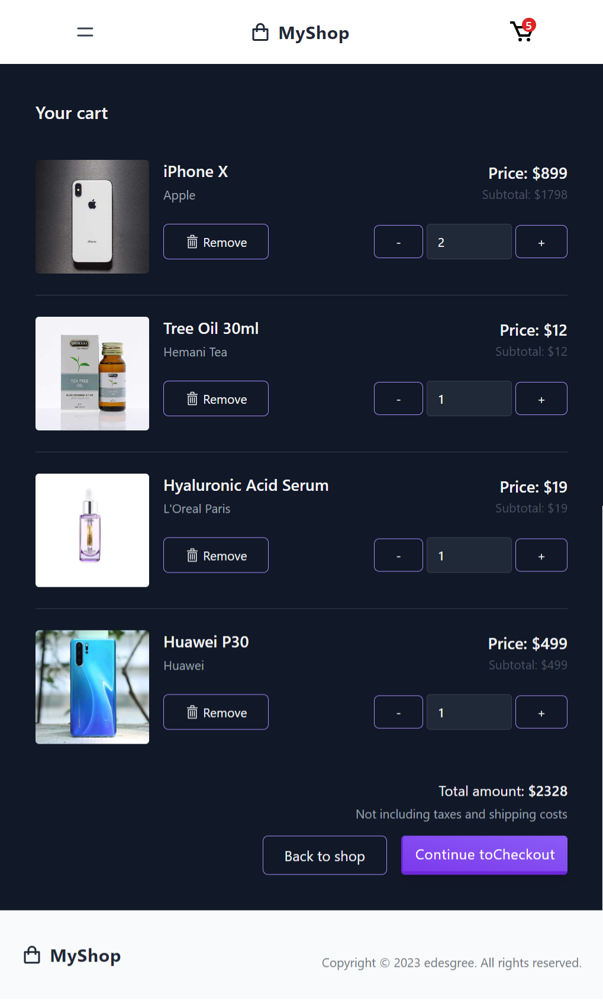

# React shopping cart

The project is to build a fake shope with product listing and a cart functionality in React.
Products are fetch from a fake store api.

🔗 **Live preview:** [here](https://charming-tanuki-fb81ad.netlify.app/)

### Screenshot

## Built with

### Technologies

- TailwindCSS
- React JS

### Tools

- Vite

## Features

- product fetching via API [dummyjson.com](https://dummyjson.com)
- products listing, product detail pages
- display product rating with stars ⭐
- products filters by categories
- add to cart/delete item, update quantity, display total price
- cart content kept in localstorage
- responsive design
- tests via `@testing-library/react`

## What I learned

- TailwindCSS templating
- display data from api
- `@testing-library/react`
- react-router-dom

## Author

👤 **Edouard Desgrée**

- GitHub: [edesgree](https://github.com/edesgree)

#### Created while working on the [The Odin Project](https://www.theodinproject.com/)
